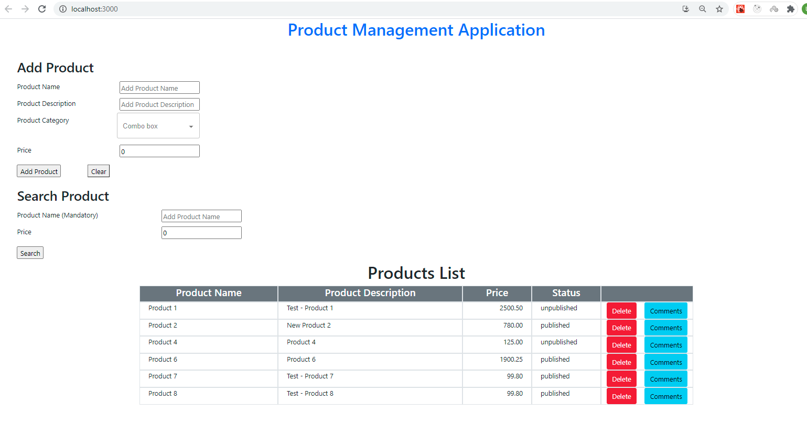

# Products-App-Full-Stack

# Packages to be installed as as Follows

In side 'server' folder:

//npm init -y

// Install Regular dependencies:

npm i express dotenv body-parser cors sequelize mysql2

// Install Dev dependencies:

npm i -D nodemon

In side 'client' folder:

//npx create-react-app .

npm i redux react-redux redux-thunk axios @material-ui/lab

To Run the Client App:
cd client
npm start

To Run the Server:
cd server
npm run server  

# MySQL Database name - product_schema

# Special Points To Note:

1. Delete Functionality

Here I have implemented the 'Delete' functionality of a Product in a way where instead of deleting the actual record from the database, I'm setting the 'status' field of the product to 'deleted' and when retrieving Products, I'm not fetching the products that are in 'deleted' status.

2. Product Search Functionality

'Product Search' can be done using 2 fields and for the simplicity of implementation, I have made the 'Product Name' field - Mandatory in this search functionality.

3. Add Product Comments
This section will be displayed when you click on the 'Comments' button related to the Product that you want to add the comment to.

4. Product Category - Auto Suggestion Box
This control will suggest the Product Categories based on the letters you enter here.

# Images

